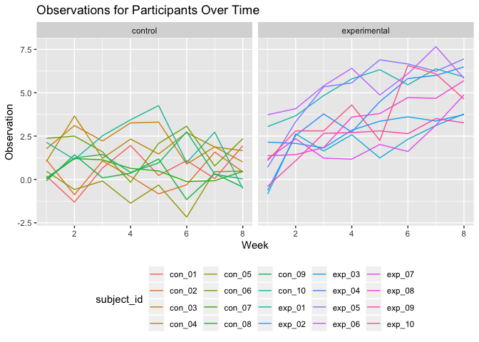

p8105\_hw5\_jc4166
================
Jerri Chen
11/08/2019

## Problem 1

``` r
set.seed(10)

iris_with_missing = iris %>% 
  map_df(~replace(.x, sample(1:150, 20), NA)) %>%
  mutate(Species = as.character(Species))
```

Write a function to replace the missing values per the following
guidelines:  
*For numeric variables, you should fill in missing values with the mean
of non-missing values  
*For character variables, you should fill in missing values with
“virginica”

``` r
missing_data = function(x) {
  output = vector(length = length(x))
  
  for (i in 1:length(x)) {
    
    if (is.numeric(x[i])) {
      mean_i = mean(x[!is.na(x)])
          if (!is.na(x[i])) {output[i] = x[i]} 
        else {output[i] = mean_i}
    }
    else if (is.character(x[i])) {
        if (!is.na(x[i])) {output[i] = x[i]} 
      else {output[i] = "virginica"}
    }
  }
  output
}

iris_with_missing =  map(iris_with_missing, missing_data) %>% 
  as_tibble()
```

## Problem 2

``` r
all_files = list.files("./data")

all_data = tibble(file_name = all_files) %>% 
  mutate(contents = map(file_name, ~read_csv(file.path("./data", .)))) %>% 
  unnest() %>% 
  mutate(subject_id = file_name) %>% 
  select(subject_id, everything()) %>% 
  separate("file_name", into = c("arm")) %>% 
  mutate(
    arm = recode(arm, 
                      "con" = "control",
                      "exp" = "experimental"),
    subject_id = substr(subject_id, 1, 6)) %>% 
  pivot_longer(
    week_1:week_8,
    names_to = "week",
    values_to = "observation"
  ) %>% 
  mutate(
    week = substr(week, 6, 7),
    week = as.numeric(week))
```

The original data came as separate csv files for each participant. The
data were combined into a single data frame, and tidied such that each
variable is a single column (study arm, week of study, and observed
value). Of note, if I wanted to present the data in a table to a human
reader, I would not have used pivot\_longer as this format is harder to
read.

Make a spaghetti plot showing observations on each subject over time

``` r
all_data %>% 
  ggplot(aes(x = week, y = observation, color = subject_id)) + 
  geom_path() + 
  facet_grid(~arm) +
  labs(
    title = "Observations for Participants Over Time",
    x = "Week",
    y = "Observation"
   ) + 
  theme(legend.position = "bottom")
```

<!-- -->

Comparing the control to the experimental participants, the observations
for the control group do not appear to change over time, whereas the
observations for the experimnetal group increase over time.

# Problem 3

Conduct a simulation to explore power in a simple linear regression.

``` r
set.seed(1)

sim_regression = function(n = 30, beta0 = 2, beta1) {
  sim_data = tibble(
    x = rnorm(n, mean = 1, sd = 1),
    y = beta0 + beta1 * x + rnorm(n, 0, 50)
  )
  
  ls_fit = lm(y ~ x, data = sim_data) %>% 
    broom::tidy()
  
  ls_fit
}

sim_regression(30, 2, 0)
```

    ## # A tibble: 2 x 5
    ##   term        estimate std.error statistic p.value
    ##   <chr>          <dbl>     <dbl>     <dbl>   <dbl>
    ## 1 (Intercept)     6.37     11.5      0.555   0.583
    ## 2 x               2.09      8.12     0.258   0.798

Set β1=0. Generate 10000 datasets from the model.

``` r
sim_results = 
  rerun(10000, sim_regression(30, 2, 0)) %>% 
  bind_rows() %>% 
  select(term, estimate, p.value)

head(sim_results)
```

    ## # A tibble: 6 x 3
    ##   term        estimate p.value
    ##   <chr>          <dbl>   <dbl>
    ## 1 (Intercept)   7.62    0.552 
    ## 2 x             0.0458  0.996 
    ## 3 (Intercept)  24.1     0.0500
    ## 4 x           -15.2     0.155 
    ## 5 (Intercept)  -6.47    0.630 
    ## 6 x            -3.21    0.718

Repeat the above for β1={1,2,3,4,5,6}.
